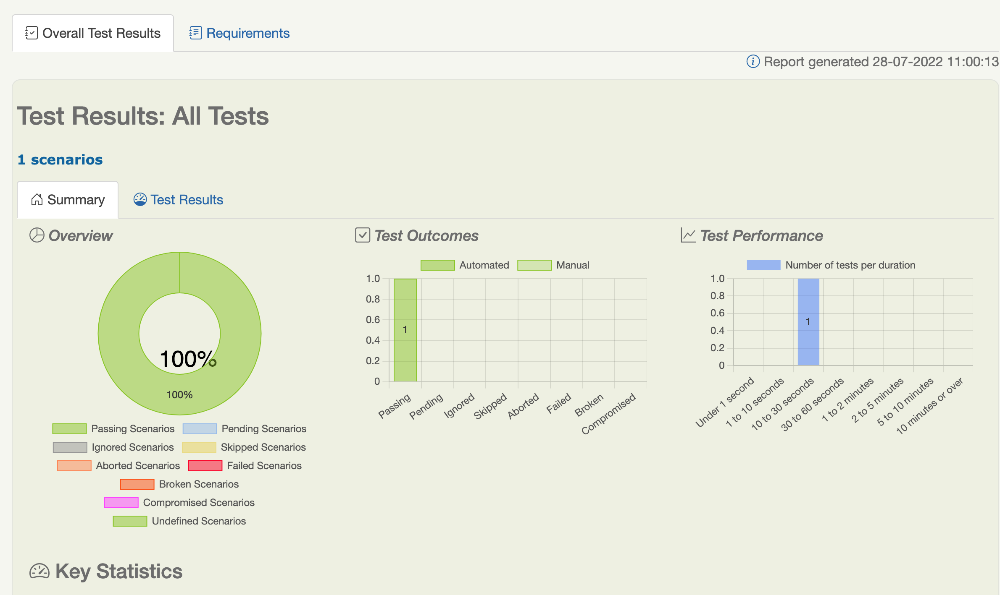
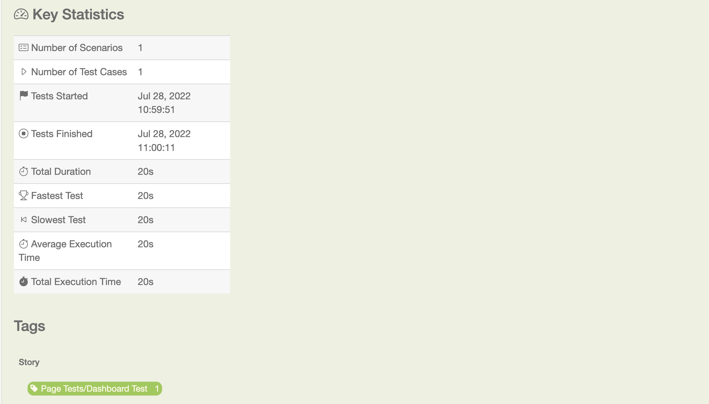
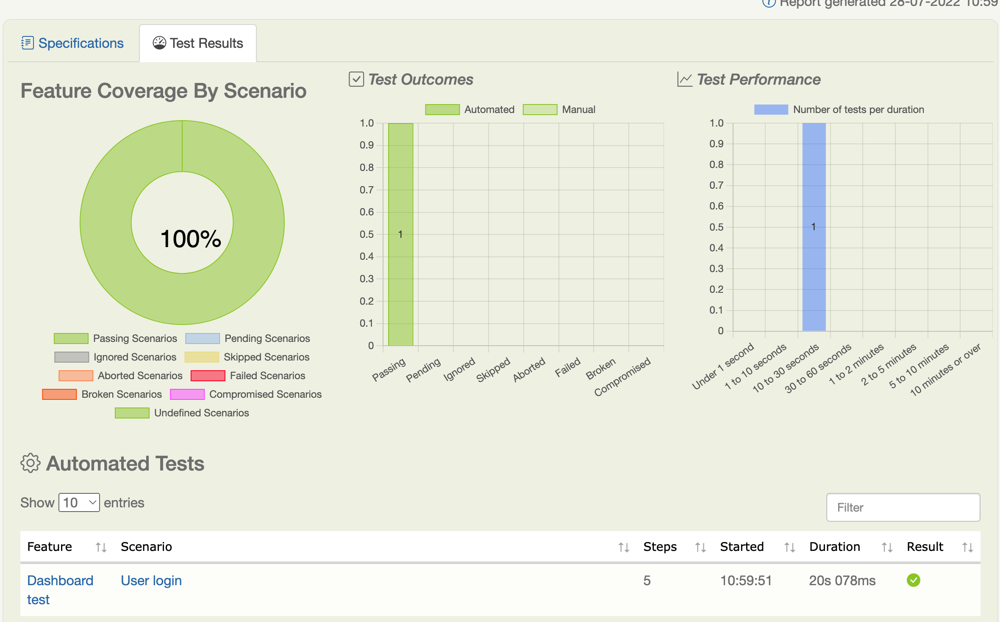
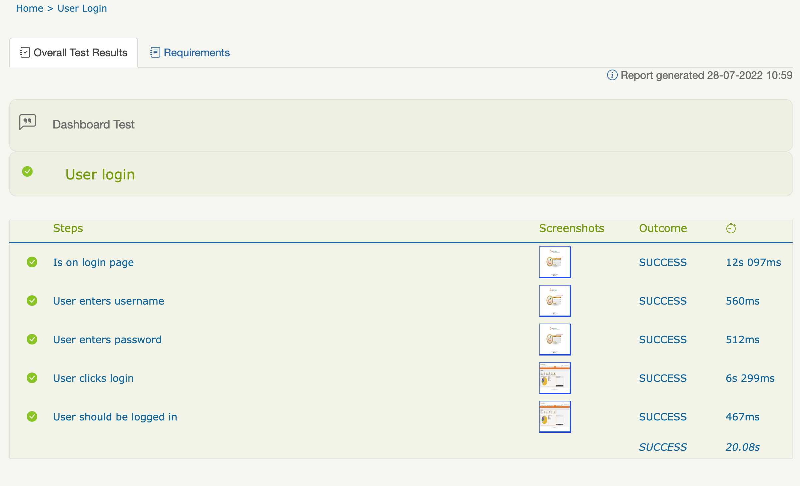
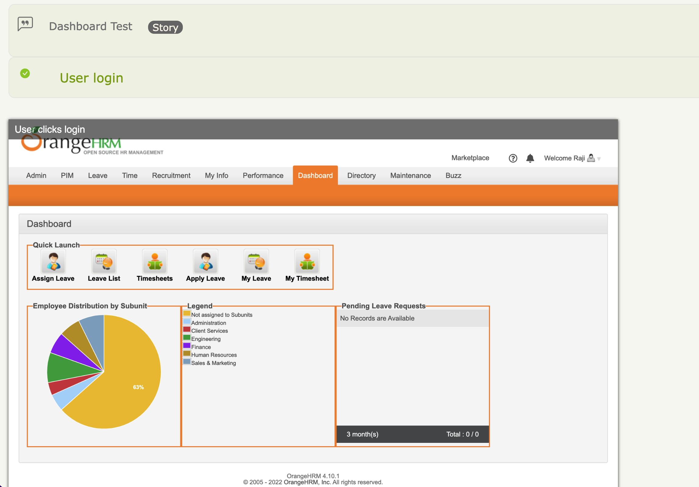

# Project with Serenity BDD
This is a QA project using gradle, serenity bdd for test automation 

Every serenity project has 3 parts similar to 3 amigos 

1. Page Object :- For web this is the page to be automated 
2. Test steps :- These are steps taken or different actions that can be done on a page 
3. The Test :- Actual test when the test steps are called. 

In this simple project , I will be automating the login to OrangeHRM page
### Setup 
The page object
```java
@DefaultUrl("https://opensource-demo.orangehrmlive.com/")
public class Dashboard extends PageObject {
    public void enterUsername() {
        $("#txtUsername").sendKeys("Admin");
    }

    public void enterPassword() {
        $("#txtPassword").sendKeys("admin123");
    }

    public void doLogin() {
        $("#btnLogin").click();
    }

    public String hasLoggedIn() {
        String heading = $("div.head h1").getText();
        return heading;
    }
}
```
The Page Object steps 
```java

public class DashboardSteps {

    private Dashboard dashboardPage;

    @Step
    public void isOnLoginPage() {
        dashboardPage.open();
    }

    @Step
    public void userEntersUsername() {
        dashboardPage.enterUsername();
    }

    @Step
    public void userEntersPassword() {
        dashboardPage.enterPassword();
    }

    @Step
    public void userClicksLogin() {
        dashboardPage.doLogin();
    }

    @Step
    public void userShouldBeLoggedIn() {
        Assertions.assertTrue(dashboardPage.hasLoggedIn().equals("Dashboard"));
    }
}

```

The Test 
```java 
@RunWith(SerenityRunner.class)
public class DashboardTest {

    @Steps
    DashboardSteps dashboardSteps;

    @Managed(driver = "chrome")
    WebDriver driver;

    @Test
    public void userLogin() {
        dashboardSteps.isOnLoginPage();
        dashboardSteps.userEntersUsername();
        dashboardSteps.userEntersPassword();
        dashboardSteps.userClicksLogin();
        dashboardSteps.userShouldBeLoggedIn();

    }

}
```

### Results




